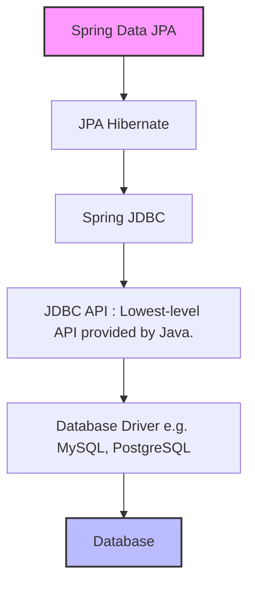

#spring #java
## Spring Data Access Layer Diagram

### Legend (What Each Block Means):

- **Spring Data JPA**: High-level abstraction. Generates queries using interfaces and annotations.
- **JPA (Hibernate)**: Standard Java API for ORM. Hibernate is the most common implementation.
- **Spring JDBC**: Lower-level abstraction for JDBC interaction.
- **JDBC API**: Core Java API to interact with databases using SQL.
- **Database Driver**: Vendor-specific (MySQL, PostgreSQL) implementation that converts JDBC calls to native protocol.
- **Database**: The actual running RDBMS instance.

📘 Spring DB Access Layers – Notes
1. Spring Data JPA
    - High-level abstraction over JPA and repositories.
    - Reduces boilerplate by generating queries from method names.
    - Auto-implements common operations like `findById()`, `save()`, etc.
    - Built on top of JPA and Hibernate.
    - Annotate with `@Repository` and extend JpaRepository, CrudRepository, etc.

2. JPA (Java Persistence API)
    - A standard for object-relational mapping (ORM).
    - Converts Java classes (entities) to DB tables and vice versa.
    - Allows powerful querying with JPQL (Java Persistence Query Language).
    - Hibernate is the most popular JPA implementation.
    - 🔹 Think of JPA as a contract; Hibernate as a provider.

3. Spring JDBC
    - Simplifies plain JDBC with utility classes (e.g., JdbcTemplate).
    - Manages connections, exceptions, boilerplate code.
    - No ORM – works directly with SQL queries.
    - 🔹 Use when full control over SQL is needed, but want Spring convenience.

4. JDBC (Java Database Connectivity)
    - Lowest-level API provided by Java.
    - Manually handle SQL, connection, result sets, etc.
    - Verbose, error-prone, but gives full control.
    - 🔹 Should only be used when ORM overhead is unacceptable.

5. Database Driver
    - Vendor-specific implementation (like MySQL Connector/J, PostgreSQL Driver).
    - Translates JDBC API calls to native DB protocol.
    - Needed for any kind of Java-DB interaction.

🧠 Summary Table

| Layer           | Abstraction | Writes SQL? | ORM? | Use When...                                    |
| --------------- | ----------- | ----------- | ---- | ---------------------------------------------- |
| Spring Data JPA | Highest     | No          | Yes  | You want speed, productivity, less boilerplate |
| JPA (Hibernate) | High        | Minimal     | Yes  | You want fine control over entities/mappings   |
| Spring JDBC     | Medium      | Yes         | No   | You want SQL control but with Spring help      |
| JDBC            | Low         | Yes         | No   | You need raw DB access and total control       |
| DB Driver       | N/A         | N/A         | N/A  | Required for DB access                         |
